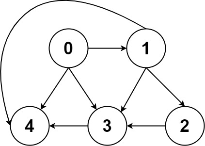

## Question 1: [Number of Islands](https://leetcode.com/problems/number-of-islands/)

Given an `m x n` 2D binary grid grid which represents a map of `'1'`s (land) and `'0'`s (water), return the number of islands.

An **island** is surrounded by water and is formed by connecting adjacent lands horizontally or vertically. You may assume all four edges of the grid are all surrounded by water.

**Example 1:**

>**Input:** grid = [<br>
  ["1","1","1","1","0"],<br>
  ["1","1","0","1","0"],<br>
  ["1","1","0","0","0"],<br>
  ["0","0","0","0","0"]<br>
]<br>
**Output:** 1

**Example 2:**

>**Input:** grid = [<br>
  ["1","1","0","0","0"],<br>
  ["1","1","0","0","0"],<br>
  ["0","0","1","0","0"],<br>
  ["0","0","0","1","1"]<br>
]<br>
**Output:** 3
 

**Constraints:**

- `m == grid.length`
- `n == grid[i].length`
- `1 <= m, n <= 300`
- `grid[i][j]` is `'0'` or `'1'`.
---
<!-- # Solution

The approach of this solution is to use a depth-first search (DFS) algorithm to find all of the connected components in the grid. A connected component is a group of cells that are all connected to each other, either directly or indirectly. An island is a connected component that is surrounded by water on all sides.

The DFS algorithm works by recursively exploring all of the cells in the grid that are connected to a given cell. To do this, the algorithm keeps track of a stack of cells to be visited. The algorithm starts by pushing the given cell onto the stack. Then, it pops the top cell off the stack and visits it. If the cell has any unvisited neighbors, the algorithm pushes them onto the stack. The algorithm continues this process until the stack is empty.

In this solution, the DFS algorithm is used to find all of the connected components in the grid that contain a cell with the value `1`. These connected components are the islands.

The algorithm works as follows:

1. Initialize a variable `island` to keep track of the number of islands found.
2. Initialize a variable `row` to store the number of rows in the grid.
3. Initialize a variable `col` to store the number of columns in the grid.
4. Iterate over the rows of the grid:
    * For each row, iterate over the columns of the grid:
        * If the cell at the current row and column has the value `1`:
            * Increment the `island` variable.
            * Call the DFS algorithm on the current cell.
5. Return the value of the `island` variable.

Here is a more detailed explanation of the DFS algorithm:

```c++
void dfs(vector<vector<char>>&grid, int i, int j) {
  // Check if the cell is out of bounds.
  if (i < 0 || i >= row || j < 0 || j >= col) {
    return;
  }

  // Check if the cell has already been visited.
  if (grid[i][j] == '0') {
    return;
  }

  // Mark the cell as visited.
  grid[i][j] = '0';

  // Recursively explore the neighboring cells.
  dfs(grid, i - 1, j);
  dfs(grid, i, j - 1);
  dfs(grid, i + 1, j);
  dfs(grid, i, j + 1);
}
```

This DFS algorithm will recursively explore all of the cells in the grid that are connected to the given cell. It will mark all of the visited cells as `0` to prevent them from being visited again.

The following is a complete example of the C++ solution:

```c++
class Solution {
public:
  int numIslands(vector<vector<char>>& grid) {
    int island = 0;
    row = grid.size();
    col = grid[0].size();
    for (int i = 0; i < row; i++) {
      for (int j = 0; j < col; j++) {
        if (grid[i][j] == '1') {
          dfs(grid, i, j);
          island++;
        }
      }
    }
    return island;
  }

private:
  int row, col;
  void dfs(vector<vector<char>>& grid, int i, int j) {
    if (i < 0 || i >= row || j < 0 || j >= col) {
      return;
    }

    if (grid[i][j] == '0') {
      return;
    }

    grid[i][j] = '0';

    dfs(grid, i - 1, j);
    dfs(grid, i, j - 1);
    dfs(grid, i + 1, j);
    dfs(grid, i, j + 1);
  }
};
``` -->


## Question 2:  [01 Matrix](https://leetcode.com/problems/01-matrix/)

Given an `m x n` binary matrix mat, return the distance of the nearest `0` for each cell.

The distance between two adjacent cells is `1`.

**Example 1:**


>**Input:** mat = [[0,0,0],[0,1,0],[0,0,0]]<br>
**Output:** [[0,0,0],[0,1,0],[0,0,0]]

**Example 2:**


>**Input:** mat = [[0,0,0],[0,1,0],[1,1,1]]<br>
**Output:** [[0,0,0],[0,1,0],[1,2,1]]
 

**Constraints:**

- `m == mat.length`
- `n == mat[i].length`
- `1 <= m, n <= 1e4`
- `1 <= m * n <= 1e4`
- `mat[i][j]` is either `0` or `1`.
- There is at least one `0` in `mat`.
---
<!-- # Solution

The approach for this solution is to use a queue to perform a breadth-first search on the matrix. We start by adding all of the cells with a value of 0 to the queue. These cells represent the starting points for our search. We then iterate over the queue, and for each cell in the queue, we check its four neighbors. If a neighbor has a value of -1, we update it to the current length of the search and add it to the queue. We continue this process until the queue is empty.

The algorithm for this solution is as follows:

1. Initialize a queue and add all of the cells with a value of 0 to the queue.
2. Set the length of the search to 0.
3. While the queue is not empty:
    * Remove the first cell from the queue.
    * For each of the four neighbors of the cell:
        * If the neighbor has a value of -1:
            * Update the neighbor to the current length of the search.
            * Add the neighbor to the queue.
    * Increment the length of the search.
4. Return the matrix.

Here is a C++ implementation of this algorithm:

```c++
class Solution {

public:
    vector<vector<int>>updateMatrix(vector<vector<int>>& mat) {
        queue<pair<int,int>>q;
        for(int i=0;i<mat.size();i++){
            for(int j=0;j<mat[0].size();j++){
                if(mat[i][j]==0)
                    q.push({i,j});
                else
                    mat[i][j]=-1;
            }
        }
        int length=0;
        int dirx[]={1,-1,0,0};
        int diry[]={0,0,1,-1};
        while(!q.empty()){
            int size=q.size();
            length++;
           while(size--){
               auto f=q.front();
               q.pop();
               int s=f.first;
               int end=f.second;
               for(int i=0;i<4;i++){
                   int r=s+dirx[i];
                   int c=end+diry[i];
                   if(r<0 || c<0 || r==mat.size() || c==mat[0].size() || mat[r][c]!=-1)
                      continue;
                   mat[r][c]=length;
                   q.push({r,c});
               }
           }
        }
        return mat;
    }
};
```

This algorithm is efficient because it only visits each cell in the matrix once. It also uses a queue to ensure that we visit the cells in the shortest possible distance from the starting points.
 -->

## Question 3: [Rotting Oranges](https://leetcode.com/problems/rotting-oranges/)

You are given an `m x n` `grid` where each cell can have one of three values:

- `0` representing an empty cell,
- `1` representing a fresh orange, or
- `2` representing a rotten orange.

Every minute, any fresh orange that is 4-directionally adjacent to a rotten orange becomes rotten.

Return the minimum number of minutes that must elapse until no cell has a fresh orange. If this is impossible, return `-1`.


**Example 1:**


>**Input:** grid = [[2,1,1],[1,1,0],[0,1,1]]<br>
**Output:** 4

**Example 2:**

>**Input:** grid = [[2,1,1],[0,1,1],[1,0,1]]<br>
**Output:** -1<br>
**Explanation:** The orange in the bottom left corner (row 2, column 0) is never rotten, because rotting only happens 4-directionally.

**Example 3:**

>**Input:** grid = [[0,2]]<br>
**Output:** 0<br>
**Explanation:** Since there are already no fresh oranges at minute 0, the answer is just 0.
 

**Constraints:**

- `m == grid.length`
- `n == grid[i].length`
- `1 <= m, n <= 10`
- `grid[i][j]` is `0`, `1`, or `2`.
---
<!-- # Solution

The approach to the solution is to use a queue to store the rotting oranges. We start by adding all the rotting oranges to the queue. Then, we iterate over the queue and check the four adjacent oranges of each rotting orange. If any of the adjacent oranges are fresh, we add them to the queue and mark them as rotten. We also decrement the count of fresh oranges. We repeat this process until the queue is empty or all the oranges have rotted.

The algorithm is as follows:

1. Initialize a queue to store the rotting oranges.
2. Initialize a count of fresh oranges.
3. Iterate over the grid and add all the rotting oranges to the queue.
4. While the queue is not empty:
    a. Get the front element of the queue and remove it.
    b. Check the four adjacent oranges of the rotting orange.
    c. If any of the adjacent oranges are fresh, add them to the queue and mark them as rotten.
    d. Decrement the count of fresh oranges.
5. If the count of fresh oranges is greater than zero, return -1.
6. Else, return the number of minutes it took for all the oranges to rot.

Here is a C++ implementation of the algorithm:

```c++
class Solution {
public:
    int orangesRotting(vector<vector<int>>& grid) {
        int row = grid.size();
        int col = grid[0].size();

        queue<pair<int,int>>que;

        int fresh = 0;

        for(int i = 0 ; i < row ; i++){
            for(int j = 0 ; j < col ; j++){
                if(grid[i][j] == 2){
                    que.push({i,j});
                }else if(grid[i][j] == 1){
                    fresh++;
                }
            }
        }
                
        int minutes = 0;
        while(!que.empty()){
            int length = que.size();
            for(int i = 0 ; i < length ; i++){
                int r = que.front().first;
                int c = que.front().second;
                que.pop();
                // top
                if(c >0 && grid[r][c-1] == 1){
                    fresh--;
                    grid[r][c-1] = 2;
                    que.push({r,c-1});
                }
                // right
                if(r < row-1 && grid[r+1][c] == 1){
                    fresh--;
                    grid[r+1][c] = 2;
                    que.push({r+1, c});
                }
                //bottom
                if(c < col-1 && grid[r][c+1] == 1){
                    fresh--;
                    grid[r][c+1] = 2;
                    que.push({r,c+1});
                }
                //left
                if(r >0 && grid[r-1][c] == 1){
                    fresh--;
                    grid[r-1][c] = 2;
                    que.push({r-1,c});
                }
            }
            minutes++;
        }

        if(fresh) return -1;

        return minutes-1 < 0 ? 0 : minutes-1;
    }
};
``` -->

## Question 4: [Course Schedule II](https://leetcode.com/problems/course-schedule-ii/)

There are a total of `numCourses` courses you have to take, labeled from `0` to `numCourses - 1`. You are given an array `prerequisites` where `prerequisites[i] = [ai, bi]` indicates that you must take course `bi` first if you want to take course `ai`.

- **For example**, the pair `[0, 1]`, indicates that to take course `0` you have to first take course `1`.

Return the ordering of courses you should take to finish all courses. If there are many valid answers, return any of them. If it is impossible to finish all courses, return **an empty array**.

**Example 1:**

>**Input:** numCourses = 2, prerequisites = [[1,0]]<br>
**Output:** [0,1]<br>
**Explanation:** There are a total of 2 courses to take. To take course 1 you should have finished course 0. So the correct course order is [0,1].

**Example 2:**

>**Input:** numCourses = 4, prerequisites = [[1,0],[2,0],[3,1],[3,2]]<br>
**Output:** [0,2,1,3]<br>
**Explanation:** There are a total of 4 courses to take. To take course 3 you should have finished both courses 1 and 2. Both courses 1 and 2 should be taken after you finished course 0.<br>
So one correct course order is [0,1,2,3]. Another correct ordering is [0,2,1,3].

**Example 3:**

>**Input:** numCourses = 1, prerequisites = []<br>
**Output:** [0]
 

**Constraints:**

- `1 <= numCourses <= 2000`
- `0 <= prerequisites.length <= numCourses * (numCourses - 1)`
- `prerequisites[i].length == 2`
- `0 <= ai, bi < numCourses`
- `ai != bi`
- All the pairs `[ai, bi]` are **distinct**.
---
<!-- # Solution

## Approach

The approach used in this solution is to use a **depth-first search** (DFS) to find a topological ordering of the courses. A topological ordering of a directed acyclic graph (DAG) is a linear ordering of the vertices such that for every directed edge uv, vertex u comes before v in the ordering.

## Algorithm

The algorithm works as follows:

1. Create an adjacency list for the graph.
2. Initialize two visited arrays, `visited` and `notVisited`, to keep track of which nodes have been visited and which nodes have not been visited yet.
3. Create a stack `result` to store the topological ordering of the courses.
4. Start a DFS from any node in the graph.
5. In the DFS, visit all of the unvisited neighbors of the current node.
6. If the DFS encounters a node that has already been visited, then the graph contains a cycle and there is no topological ordering.
7. Once the DFS has finished exploring all of the nodes in the graph, push the current node onto the stack `result`.
8. Repeat steps 4-7 until all of the nodes in the graph have been visited.
9. Reverse the stack `result` to get the topological ordering of the courses.

## C++ Implementation

The following is a C++ implementation of the algorithm described above:

```c++
class Solution {
    bool dfs(vector<int>adj[], vector<bool>&visited, vector<bool>&notVisited, vector<int>&result, const int &node){
        if(notVisited[node])
            return true;
        if(visited[node])
            return false;
        
        visited[node] = notVisited[node] = true;

        for(auto &n : adj[node])
            if(dfs(adj, visited, notVisited, result, n))
                return true;
        
        notVisited[node] = false;
        result.push_back(node);
        return false;
    }
public:
    vector<int>findOrder(const int &numCourses, vector<vector<int>>& prerequisites) {
        vector<int>adj[numCourses];

        for(auto it : prerequisites){
            adj[it[1]].push_back(it[0]);
        }

        vector<bool>visited(numCourses, false), notVisited(numCourses, false);
        vector<int>result;

        for(int node = 0 ; node < numCourses ; node++){
            if(!visited[node] && dfs(adj, visited, notVisited, result, node))
                return {};
        }
        reverse(result.begin(), result.end());
        return result;
    }
};
```

## Example Usage

The following is an example of how to use the `findOrder()` function:

```c++
Solution solution;

vector<vector<int>>prerequisites = {{1, 0}, {2, 0}, {3, 1}, {3, 2}};
vector<int>order = solution.findOrder(4, prerequisites);

if (order.empty()) {
  cout << "No topological ordering exists." << endl;
} else {
  cout << "A topological ordering is: ";
  for (int i = 0; i < order.size(); i++) {
    cout << order[i] << " ";
  }
  cout << endl;
}
```

Output:

```
A topological ordering is: 0 1 2 3
``` -->

## Question 5: [Accounts Merge](https://leetcode.com/problems/accounts-merge/)

Given a list of `accounts` where each element `accounts[i]` is a list of strings, where the first element `accounts[i][0]` is a name, and the rest of the elements are emails representing emails of the account.

Now, we would like to merge these accounts. Two accounts definitely belong to the same person if there is some common email to both accounts. Note that even if two accounts have the same name, they may belong to different people as people could have the same name. A person can have any number of accounts initially, but all of their accounts definitely have the same name.

After merging the accounts, return the accounts in the following format: the first element of each account is the name, and the rest of the elements are emails in sorted order. The accounts themselves can be returned in any order.

**Example 1:**

>**Input:** accounts = [["John","johnsmith@mail.com","john_newyork@mail.com"],["John","johnsmith@mail.com","john00@mail.com"],["Mary","mary@mail.com"],["John","johnnybravo@mail.com"]]<br>
**Output:** [["John","john00@mail.com","john_newyork@mail.com","johnsmith@mail.com"],["Mary","mary@mail.com"],["John","johnnybravo@mail.com"]]<br>
**Explanation:**<br>
The first and second John's are the same person as they have the common email "johnsmith@mail.com".<br>
The third John and Mary are different people as none of their email addresses are used by other accounts.<br>
We could return these lists in any order, for example the answer [['Mary', 'mary@mail.com'], ['John', 'johnnybravo@mail.com'], 
['John', 'john00@mail.com', 'john_newyork@mail.com', 'johnsmith@mail.com']] would still be accepted.

**Example 2:**

>**Input:** accounts = [["Gabe","Gabe0@m.co","Gabe3@m.co","Gabe1@m.co"],["Kevin","Kevin3@m.co","Kevin5@m.co","Kevin0@m.co"],["Ethan","Ethan5@m.co","Ethan4@m.co","Ethan0@m.co"],["Hanzo","Hanzo3@m.co","Hanzo1@m.co","Hanzo0@m.co"],["Fern","Fern5@m.co","Fern1@m.co","Fern0@m.co"]]<br>
**Output:** [["Ethan","Ethan0@m.co","Ethan4@m.co","Ethan5@m.co"],["Gabe","Gabe0@m.co","Gabe1@m.co","Gabe3@m.co"],["Hanzo","Hanzo0@m.co","Hanzo1@m.co","Hanzo3@m.co"],["Kevin","Kevin0@m.co","Kevin3@m.co","Kevin5@m.co"],["Fern","Fern0@m.co","Fern1@m.co","Fern5@m.co"]]
 

**Constraints:**

- `1 <= accounts.length <= 1000`
- `2 <= accounts[i].length <= 10`
- `1 <= accounts[i][j].length <= 30`
- `accounts[i][0]` consists of English letters.
- `accounts[i][j] (for j >0)` is a valid email.
---
<!-- # Solution

**Approach:**

This solution uses a **graph** to represent the relationships between the email addresses. Each node in the graph represents an email address, and there is an edge between two nodes if the corresponding email addresses are associated with the same account.

The algorithm works as follows:

1. Create a graph to represent the relationships between the email addresses.
2. Perform a **depth-first search (DFS)** on the graph, starting from each unvisited email address.
3. During the DFS, add the current email address to a list.
4. When the DFS reaches a visited email address, stop and add the list of email addresses to the result.

**Algorithm:**

```c++
void dfs(unordered_map<string, unordered_set<string>>& graph, unordered_set<string>& visited, string s, vector<string>& ans) {
  ans.push_back(s);
  visited.insert(s);
  for (string str : graph[s]) {
    if (visited.find(str) == visited.end()) {
      dfs(graph, visited, str, ans);
    }
  }
}

vector<vector<string>>accountsMerge(vector<vector<string>>& accounts) {
  vector<vector<string>>result;
  unordered_map<string, unordered_set<string>>graph;
  for (auto& ls : accounts) {
    for (int i = 1; i < ls.size(); i++) {
      graph[ls[i]].insert(ls[1]);
      graph[ls[1]].insert(ls[i]);
    }
  }

  unordered_set<string>visited;
  for (auto& ls : accounts) {
    if (visited.find(ls[1]) == visited.end()) {
      vector<string>ans;
      dfs(graph, visited, ls[1], ans);
      sort(ans.begin(), ans.end());
      ans.insert(ans.begin(), ls[0]);
      result.push_back(ans);
    }
  }

  return result;
}
```

**Example:**

```c++
vector<vector<string>>accounts = {
  {"John", "johnsmith@mail.com", "john_newyork@mail.com"},
  {"John", "johnsmith@mail.com", "john00@mail.com"},
  {"Mary", "mary@mail.com"},
  {"John", "johnnybravo@mail.com"}
};

vector<vector<string>>result = accountsMerge(accounts);

for (auto& ls : result) {
  for (auto& str : ls) {
    cout << str << " ";
  }
  cout << endl;
}
```

Output:

```
John john00@mail.com john_newyork@mail.com johnsmith@mail.com
Mary mary@mail.com
John johnnybravo@mail.com
``` -->

## Question 6: [Word Search](https://leetcode.com/problems/word-search/)

Given an `m x n` grid of characters `board` and a string `word`, return `true` if word exists in the grid.

The word can be constructed from letters of sequentially adjacent cells, where adjacent cells are horizontally or vertically neighboring. The same letter cell may not be used more than once.

 


**Example 1:**


>**Input:** board = [["A","B","C","E"],["S","F","C","S"],["A","D","E","E"]], word = "ABCCED"<br>
**Output:** true

**Example 2:**


>**Input:** board = [["A","B","C","E"],["S","F","C","S"],["A","D","E","E"]], word = "SEE"<br>
**Output:** true

**Example 3:**


>**Input:** board = [["A","B","C","E"],["S","F","C","S"],["A","D","E","E"]], word = "ABCB"<br>
**Output:** false
 

Constraints:

- `m == board.length`
- `n = board[i].length`
- `1 <= m, n <= 6`
- `1 <= word.length <= 15`
- `board` and `word` consists of only lowercase and uppercase English letters.
 

**Follow up:** Could you use search pruning to make your solution faster with a larger `board`?

---
<!-- # Solution

The approach of the solution is to use a depth-first search (DFS) to traverse the board and look for a path that spells out the word. The DFS algorithm starts at a given cell and recursively explores all of its neighbors. If a neighbor matches the next letter of the word, the DFS algorithm continues to explore that neighbor. If the DFS algorithm reaches the end of the word, then the word has been found.

The algorithm for the solution is as follows:

```c++
class Solution {
    string word;
    int row,col;
    bool DFS(const int &i, const int &j, const int &idx, vector<vector<char>>& board){
        if(idx == word.length()) return true;

        if(i < 0 || j < 0 || i >= row || j >= col || board[i][j] != word[idx]) return false;

        char ch = board[i][j];
        board[i][j] = ' ';

        bool found = DFS(i-1, j, idx+1, board) || 
                     DFS(i, j-1, idx+1, board) || 
                     DFS(i+1, j, idx+1, board) || 
                     DFS(i, j+1, idx+1, board);
        board[i][j] = ch;
        return found;                
    }
public:
    bool exist(vector<vector<char>>& board, string &word) {
        if(word == "") return true;

        this->word = word;
        row = board.size();
        col = board[0].size();
        for(int i = 0 ; i < row ; i++){
            for(int j = 0 ; j < col ; j++){
                if(board[i][j] == word[0])
                    if(DFS(i,j,0,board)) return true;
            }
        }
        return false;
    }
};
```

The DFS algorithm is implemented in the `DFS()` function. This function takes four arguments:

* `i`: The row index of the current cell.
* `j`: The column index of the current cell.
* `idx`: The index of the next letter of the word to look for.
* `board`: The board to search.

The `DFS()` function returns `true` if the word has been found, and `false` otherwise.

The main function of the solution is the `exist()` function. This function takes two arguments:

* `board`: The board to search.
* `word`: The word to look for.

The `exist()` function returns `true` if the word has been found in the board, and `false` otherwise.

To use the solution, simply create a new instance of the `Solution` class and call the `exist()` function with the board and word to search for. -->

## Question 7: [Minimum Height Trees](https://leetcode.com/problems/minimum-height-trees/)

A tree is an undirected graph in which any two vertices are connected by exactly one path. In other words, any connected graph without simple cycles is a tree.

Given a tree of `n` nodes labelled from `0` to `n - 1`, and an array of `n - 1` `edges` where `edges[i] = [ai, bi]` indicates that there is an undirected edge between the two nodes `ai` and `bi` in the tree, you can choose any node of the tree as the root. When you select a node `x` as the root, the result tree has height `h`. Among all possible rooted trees, those with minimum height (i.e. `min(h)`)  are called minimum height trees (MHTs).

Return a list of all MHTs' root labels. You can return the answer in any order.

The height of a rooted tree is the number of edges on the longest downward path between the root and a leaf.

**Example 1:**


>**Input:** n = 4, edges = [[1,0],[1,2],[1,3]]<br>
**Output:** [1]<br>
**Explanation:** As shown, the height of the tree is 1 when the root is the node with label 1 which is the only MHT.

**Example 2:**


>**Input:** n = 6, edges = [[3,0],[3,1],[3,2],[3,4],[5,4]]<br>
**Output:** [3,4]
 

**Constraints:**

- `1 <= n <= 2 * 1e4`
- `edges.length == n - 1`
- `0 <= ai, bi < n`
- `ai != bi`
- All the pairs `(ai, bi)` are distinct.
- The given input is guaranteed to be a tree and there will be no repeated edges.
---
<!-- # Solution
Here is an approach and algorithm for the C++ solution to the problem of finding the minimum height trees:

**Approach:**

The approach is to use a queue to store the leaf nodes of the tree. We start by initializing the queue with all the nodes that have a degree of 1 (i.e., they are leaf nodes). Then, we repeatedly remove the nodes from the queue and decrement the degree of all their neighbors. If the degree of a neighbor becomes 1, we add it to the queue. This process continues until only a few nodes are left in the queue. These nodes are the minimum height trees of the original tree.

**Algorithm:**
This problem is solved by a topological sort approach. The algorithm is as follows:

1. Create a graph adjacency list.
2. Calculate the degree of each node in the graph.
3. Add all nodes with degree 1 to a queue.
4. While the queue is not empty:
    * Remove a node from the queue.
    * For each neighbor of the node:
        * Decrement the degree of the neighbor.
        * If the degree of the neighbor becomes 1, add it to the queue.
5. Return the nodes in the queue.

This algorithm works because nodes with degree 1 are always leaves in a tree. By repeatedly removing leaves from the tree, we eventually reach a point where the only nodes left are the root nodes of the tree.


```c++
class Solution {
public:
    vector<int>findMinHeightTrees(int n, vector<vector<int>>& edges) {
        if(n == 1) return {0};

        vector<vector<int>>graph(n);
        vector<int>degree(n,0);
        for(auto edge : edges){
            graph[edge[0]].push_back(edge[1]);
            graph[edge[1]].push_back(edge[0]);

            degree[edge[0]]++;
            degree[edge[1]]++;
        }

        queue<int>que;

        for(int i = 0 ; i < n ; i++)
            if(degree[i] == 1)
                que.push(i);
        

        while(n >2){
            int length = que.size();
            n -= length;
            while(length--){
                int node = que.front();
                que.pop();
                for(auto root : graph[node]){
                    degree[root]--;
                    if(degree[root] == 1) 
                        que.push(root);
                }   
            }
        }

        vector<int>roots;

        while(!que.empty()){
            roots.push_back(que.front());
            que.pop();
        }
        return roots;
    }
};
```

**Complexity:**

The time complexity of the algorithm is O(n), where n is the number of nodes in the tree. This is because we visit each node of the tree at most once. The space complexity of the algorithm is O(n), where n is the number of nodes in the tree. This is because we need to store the queue and the degree of each node. -->

## Question 8: [Pacific Atlantic Water Flow](https://leetcode.com/problems/pacific-atlantic-water-flow/)

There is an `m x n` rectangular island that borders both the Pacific Ocean and Atlantic Ocean. The Pacific Ocean touches the island's left and top edges, and the Atlantic Ocean touches the island's right and bottom edges.

The island is partitioned into a grid of square cells. You are given an `m x n` integer matrix `heights` where `heights[r][c]` represents the height above sea level of the cell at coordinate `(r, c)`.

The island receives a lot of rain, and the rain water can flow to neighboring cells directly north, south, east, and west if the neighboring cell's height is less than or equal to the current cell's height. Water can flow from any cell adjacent to an ocean into the ocean.

Return a 2D list of grid coordinates `result` where `result[i] = [ri, ci]` denotes that rain water can flow from cell `(ri, ci)` to both the Pacific and Atlantic oceans.

**Example 1:**


>**Input:** heights = [[1,2,2,3,5],[3,2,3,4,4],[2,4,5,3,1],[6,7,1,4,5],[5,1,1,2,4]]<br>
**Output:** [[0,4],[1,3],[1,4],[2,2],[3,0],[3,1],[4,0]]<br>
**Explanation:** The following cells can flow to the Pacific and Atlantic oceans, as shown below:
><pre>
>[0,4]: [0,4] ->Pacific Ocean 
>      [0,4] ->Atlantic Ocean
>[1,3]: [1,3] ->[0,3] ->Pacific Ocean 
>      [1,3] ->[1,4] ->Atlantic Ocean
>[1,4]: [1,4] ->[1,3] ->[0,3] ->Pacific Ocean 
>      [1,4] ->Atlantic Ocean
>[2,2]: [2,2] ->[1,2] ->[0,2] ->Pacific Ocean 
>      [2,2] ->[2,3] ->[2,4] ->Atlantic Ocean
>[3,0]: [3,0] ->Pacific Ocean 
>      [3,0] ->[4,0] ->Atlantic Ocean
>[3,1]: [3,1] ->[3,0] ->Pacific Ocean 
>      [3,1] ->[4,1] ->Atlantic Ocean
>[4,0]: [4,0] ->Pacific Ocean 
>      [4,0] ->Atlantic Ocean
></pre>
>Note that there are other possible paths for these cells to flow to the Pacific and Atlantic oceans.

**Example 2:**

>**Input:** heights = [[1]]<br>
**Output:** [[0,0]]<br>
**Explanation:** The water can flow from the only cell to the Pacific and Atlantic oceans.
 

Constraints:

- `m == heights.length`
- `n == heights[r].length`
- `1 <= m, n <= 200`
- `0 <= heights[r][c] <= 1e5`
---
<!-- # Solution

**Approach**

The approach for the given solution is to use a depth-first search (DFS) traversal to mark all the cells that are reachable from the Pacific and Atlantic oceans separately. Once all the reachable cells from both oceans have been marked, we can return the cells that are marked by both oceans.

**Algorithm**

The following is a step-by-step algorithm for the given C++ solution:

1. Create two boolean matrices, `pacific` and `atlantic`, to keep track of the cells that are reachable from the Pacific and Atlantic oceans, respectively.
2. Initialize all cells in both matrices to `false`.
3. Perform a DFS traversal from all the cells that are directly connected to the Pacific ocean. During the DFS traversal, mark all the visited cells in the `pacific` matrix to `true`.
4. Perform a DFS traversal from all the cells that are directly connected to the Atlantic ocean. During the DFS traversal, mark all the visited cells in the `atlantic` matrix to `true`.
5. Iterate over the entire matrix and return all the cells that are marked as `true` in both the `pacific` and `atlantic` matrices.

**C++ Implementation**

The following is a C++ implementation of the above algorithm:

```c++
class Solution {
public:
    vector<vector<int>>pacificAtlantic(vector<vector<int>>& heights) {
        int n = heights.size(), m = heights[0].size();
        vector<vector<bool>>pacific(n, vector<bool>(m, false)), atlantic(n, vector<bool>(m, false));

        for (int i = 0; i < n; i++) {
            dfs(heights, pacific, i, 0);
            dfs(heights, atlantic, i, m - 1);
        }
        for (int j = 0; j < m; j++) {
            dfs(heights, pacific, 0, j);
            dfs(heights, atlantic, n - 1, j);
        }

        vector<vector<int>>result;
        for (int i = 0; i < n; i++) {
            for (int j = 0; j < m; j++) {
                if (pacific[i][j] && atlantic[i][j]) {
                    result.push_back({i, j});
                }
            }
        }
        return result;
    }

private:
    void dfs(vector<vector<int>>& heights, vector<vector<bool>>& visited, int i, int j) {
        if (visited[i][j]) return;
        visited[i][j] = true;

        if (i >0 && heights[i][j] >= heights[i - 1][j]) dfs(heights, visited, i - 1, j);
        if (j >0 && heights[i][j] >= heights[i][j - 1]) dfs(heights, visited, i, j - 1);
        if (i < heights.size() - 1 && heights[i][j] >= heights[i + 1][j]) dfs(heights, visited, i + 1, j);
        if (j < heights[0].size() - 1 && heights[i][j] >= heights[i][j + 1]) dfs(heights, visited, i, j + 1);
    }
};
``` -->

## Question 4: [Cheapest Flights Within K Stops](https://leetcode.com/problems/cheapest-flights-within-k-stops/)

There are `n` cities connected by some number of flights. You are given an array `flights` where `flights[i] = [fromi, toi, pricei]` indicates that there is a flight from city `fromi` to city `toi` with cost `pricei`.

You are also given three integers `src`, `dst`, and `k`, return the cheapest price from `src` to `dst` with at most `k` stops. If there is no such route, return `-1`.

 


**Example 1:**


>**Input:** n = 4, flights = [[0,1,100],[1,2,100],[2,0,100],[1,3,600],[2,3,200]], src = 0, dst = 3, k = 1<br>
**Output:** 700<br>
**Explanation:**<br>
The graph is shown above.<br>
The optimal path with at most 1 stop from city 0 to 3 is marked in red and has cost 100 + 600 = 700.
Note that the path through cities [0,1,2,3] is cheaper but is invalid because it uses 2 stops.

**Example 2:**


>**Input:** n = 3, flights = [[0,1,100],[1,2,100],[0,2,500]], src = 0, dst = 2, k = 1<br>
**Output:** 200<br>
**Explanation:**<br>
The graph is shown above.<br>
The optimal path with at most 1 stop from city 0 to 2 is marked in red and has cost 100 + 100 = 200.

**Example 3:**


>**Input:** n = 3, flights = [[0,1,100],[1,2,100],[0,2,500]], src = 0, dst = 2, k = 0<br>
**Output:** 500<br>
**Explanation:**<br>
The graph is shown above.<br>
The optimal path with no stops from city 0 to 2 is marked in red and has cost 500.
 

**Constraints:**

- `1 <= n <= 100`
- `0 <= flights.length <= (n * (n - 1) / 2)`
- `flights[i].length == 3`
- `0 <= fromi, toi < n`
- `fromi != toi`
- `1 <= pricei <= 1e4`
- There will not be any multiple flights between two cities.
- `0 <= src, dst, k < n`
- `src != dst`
---
<!-- # Solution

The approach for the C++ solution to the problem of finding the cheapest price with at most k stops is to use a priority queue to implement Dijkstra's algorithm. The priority queue will keep track of the nodes that need to be visited, and the distance from the source node to each node. The algorithm will start at the source node and iterate over the nodes in the priority queue, visiting the node with the shortest distance from the source node first. If the node that is visited is the destination node, then the algorithm will terminate and return the distance from the source node to the destination node. Otherwise, the algorithm will add all of the neighbors of the current node to the priority queue, with the distance from the source node to each neighbor updated to include the cost of the flight from the current node to the neighbor.

Here is a more detailed algorithm:

1. Initialize a priority queue `q` to be empty.
2. Initialize a distance array `dis` to be `INT_MAX` for all nodes.
3. Set `dis[src] = 0`.
4. Add the source node to the priority queue with priority `0`.
5. While the priority queue is not empty:
    * Remove the node with the highest priority from the priority queue and assign it to `u`.
    * If `u` is the destination node, then terminate the algorithm and return `dis[u]`.
    * For each neighbor `v` of `u`:
        * If `dis[u] + cost(u, v) < dis[v]`, then update `dis[v] = dis[u] + cost(u, v)` and add `v` to the priority queue with priority `dis[v]`.

The time complexity of the algorithm is O(V^2 log V), where V is the number of nodes in the graph. The space complexity of the algorithm is O(V), where V is the number of nodes in the graph.

Here is an example of how to use the algorithm in C++:

```c++
#include <queue>
#include <vector>

using namespace std;

class Solution {
public:
    vector<pair<int, int>>adj[105];
    int findCheapestPrice(int n, vector<vector<int>>& flights, int src, int dst, int k) {
        for (int i = 0; i < flights.size(); i++) {
            adj[flights[i][0]].push_back({flights[i][1], flights[i][2]});
        }

        vector<int>dis(n, INT_MAX);
        priority_queue<pair<int, int>, vector<pair<int, int>>, greater<pair<int, int>>>q;
        q.push({0, src});
        dis[src] = 0;

        while (!q.empty()) {
            auto p = q.top();
            q.pop();

            int stop = p.first;
            int u = p.second;

            if (stop >k + 1) {
                continue;
            }

            for (auto i : adj[u]) {
                int v = i.first;
                int d = i.second;

                if (d + dis[u] < dis[v]) {
                    dis[v] = d + dis[u];
                    q.push({stop + 1, v});
                }
            }
        }

        if (dis[dst] == INT_MAX) {
            return -1;
        }

        return dis[dst];
    }
};
``` -->

## Question 5: [Max Area of Island](https://leetcode.com/problems/max-area-of-island/)

You are given an `m x n` binary matrix `grid`. An island is a group of `1`'s (representing land) connected 4-directionally (horizontal or vertical.) You may assume all four edges of the grid are surrounded by water.

The area of an island is the number of cells with a value `1` in the island.

Return the maximum area of an island in `grid`. If there is no island, return `0`.

 


**Example 1:**


>**Input:** grid = [[0,0,1,0,0,0,0,1,0,0,0,0,0],[0,0,0,0,0,0,0,1,1,1,0,0,0],[0,1,1,0,1,0,0,0,0,0,0,0,0],[0,1,0,0,1,1,0,0,1,0,1,0,0],[0,1,0,0,1,1,0,0,1,1,1,0,0],[0,0,0,0,0,0,0,0,0,0,1,0,0],[0,0,0,0,0,0,0,1,1,1,0,0,0],[0,0,0,0,0,0,0,1,1,0,0,0,0]]<br>
**Output:** 6<br>
**Explanation:** The answer is not 11, because the island must be connected 4-directionally.

**Example 2:**

>**Input:** grid = [[0,0,0,0,0,0,0,0]]<br>
**Output:** 0
 

Constraints:

- `m == grid.length`
- `n == grid[i].length`
- `1 <= m, n <= 50`
- `grid[i][j]` is either `0` or `1`.
---
<!-- # Solution

The approach taken in this solution is to use a depth-first search (DFS) to traverse the grid and find all of the connected 1's. The algorithm is as follows:

1. Initialize the row and col variables to the height and width of the grid, respectively.
2. Initialize the maxArea variable to 0.
3. Initialize the sum variable to 0.
4. Iterate over the grid:
    * If the current cell is 1 and has not yet been visited:
        * Mark the cell as visited.
        * Increment the sum variable.
        * Recursively call the DFS function on the four adjacent cells.
5. After the DFS function has finished executing, the sum variable will contain the area of the largest island in the grid.
6. Update the maxArea variable if the sum variable is greater than maxArea.
7. Return the maxArea variable.

The algorithm works by recursively exploring the grid, starting from each cell that is 1 and has not yet been visited. As the algorithm explores the grid, it marks each cell that it visits as visited and increments the sum variable. The algorithm terminates when it has reached a cell that is 0 or a cell that has already been visited.

The algorithm is written in C++ as follows:

```c++
class Solution {
    int row, col;
    int maxArea = 0;
    int sum = 0;
    void dfs(int i, int j, vector<vector<int>>& grid){
        if(i < 0 || j < 0 || i >=row || j >= col || grid[i][j] == 0) return;
            grid[i][j] = 0;
        sum ++;
        dfs(i-1, j, grid);
        dfs(i, j-1, grid);
        dfs(i+1, j, grid);
        dfs(i, j+1, grid);
    }
public:
    int maxAreaOfIsland(vector<vector<int>>& grid) {
        row = grid.size();
        col = grid[0].size();

        for(int i = 0 ; i < row ; i++)
            for(int j = 0 ; j < col ; j++)
                if(grid[i][j]){
                    sum = 0;
                    dfs(i,j,grid);
                    maxArea = max(maxArea, sum);
                }
            
        return maxArea;
    }
};
```

To use the solution, simply create an instance of the `Solution` class and call the `maxAreaOfIsland()` function, passing in the grid as a parameter. The function will return the maximum area of an island in the grid. -->

## Question 6: [Evaluate Division](https://leetcode.com/problems/evaluate-division/)

You are given an array of variable pairs equations and an array of real numbers values, where `equations[i] = [Ai, Bi]` and `values[i]` represent the equation `Ai / Bi = values[i]`. Each `Ai` or `Bi` is a string that represents a single variable.

You are also given some queries, where `queries[j] = [Cj, Dj]` represents the jth query where you must find the answer for `Cj / Dj = ?`.

Return the answers to all queries. If a single answer cannot be determined, return `-1.0`.

**Note:** The input is always valid. You may assume that evaluating the queries will not result in division by zero and that there is no contradiction.

**Note:** The variables that do not occur in the list of equations are undefined, so the answer cannot be determined for them.

 


**Example 1:**

>**Input:** equations = [["a","b"],["b","c"]], values = [2.0,3.0], queries = [["a","c"],["b","a"],["a","e"],["a","a"],["x","x"]]<br>
**Output:** [6.00000,0.50000,-1.00000,1.00000,-1.00000]<br>
**Explanation:**<br>
Given: a / b = 2.0, b / c = 3.0<br>
queries are: a / c = ?, b / a = ?, a / e = ?, a / a = ?, x / x = ? <br>
return: [6.0, 0.5, -1.0, 1.0, -1.0 ]<br>
note: x is undefined =>-1.0

**Example 2:**

>**Input:** equations = [["a","b"],["b","c"],["bc","cd"]], values = [1.5,2.5,5.0], queries = [["a","c"],["c","b"],["bc","cd"],["cd","bc"]]<br>
**Output:** [3.75000,0.40000,5.00000,0.20000]

**Example 3:**

>**Input:** equations = [["a","b"]], values = [0.5], queries = [["a","b"],["b","a"],["a","c"],["x","y"]]<br>
**Output:** [0.50000,2.00000,-1.00000,-1.00000]
 

Constraints:

- `1 <= equations.length <= 20`
- `equations[i].length == 2`
- `1 <= Ai.length, Bi.length <= 5`
- `values.length == equations.length`
- `0.0 < values[i] <= 20.0`
- `1 <= queries.length <= 20`
- `queries[i].length == 2`
- `1 <= Cj.length, Dj.length <= 5`
- `Ai, Bi, Cj, Dj` consist of lower case English letters and digits.
---
<!-- # Solution

This solution makes use of a graph to represent the relationships between the different currencies. The nodes of the graph represent the currencies and the edges represent the exchange rates between the currencies. The weight of an edge is the exchange rate from the source currency to the destination currency.

The algorithm works by first constructing a graph from the given equations. Then, for each query, the algorithm performs a depth-first search on the graph to find a path from the source currency to the destination currency. The weight of the path is the exchange rate between the two currencies.

If the algorithm is unable to find a path between the two currencies, then the query returns `-1`. Otherwise, the query returns the weight of the path.

Here is a summary of the algorithm:

1. Construct a graph from the given equations.
2. For each query:
    * Perform a depth-first search on the graph to find a path from the source currency to the destination currency.
    * If a path is found, return the weight of the path. Otherwise, return `-1`.

Here is a C++ implementation of the algorithm:

```c++
class Solution {
    unordered_map<string, double>mp;
    unordered_map<string, vector<string>>graph;
    void dfs(string &ai, string &bi, double &value, unordered_map<string, int>&visited, bool &found){
        visited[ai]++;
        if(found) return;
        for(auto it : graph[ai]){
            if(visited[it] != 1){
                value *= mp[ai+"->"+it];
                if(bi == it){
                    found = true;
                    return;
                }
                dfs(it,bi,value,visited,found);
                if(found) return;
                else value /= mp[ai+"->"+it];
            }
        }
    }

public:
    vector<double>calcEquation(vector<vector<string>>& equations, vector<double>& values, vector<vector<string>>& queries) {
        vector<double>result;

        int i = 0;
        for(auto equation : equations){
            string ai = equation[0];
            string bi = equation[1];

            mp[ai+"->"+bi] = values[i];
            mp[bi+"->"+ai] = 1/values[i];
            graph[bi].push_back(ai);
            graph[ai].push_back(bi);
            i++;
        }

        for(auto query : queries){
            string ai = query[0];
            string bi = query[1];

            if(graph.find(ai) == graph.end() || graph.find(bi) == graph.end()){
                result.push_back(-1);
                continue;
            }
            double value = 1;
            bool found = false;
            if(ai == bi){
                found = true;
            }else{
                unordered_map<string, int>visited;
                dfs(ai,bi,value,visited,found);
            }
            if(found)
                result.push_back(value);
            else 
                result.push_back(-1);
        }
        return result;
    }
};
``` -->

## Question 7: [Number of Provinces](https://leetcode.com/problems/number-of-provinces/)

There are `n` cities. Some of them are connected, while some are not. If city `a` is connected directly with city `b`, and city `b` is connected directly with city `c`, then city `a` is connected indirectly with city `c`.

A province is a group of directly or indirectly connected cities and no other cities outside of the group.

You are given an n x n matrix isConnected where `isConnected[i][j] = 1` if the `ith` city and the `jth` city are directly connected, and `isConnected[i][j] = 0` otherwise.

Return the total number of provinces.

**Example 1:**


>**Input:** isConnected = [[1,1,0],[1,1,0],[0,0,1]]<br>
**Output:** 2

**Example 2:**


>**Input:** isConnected = [[1,0,0],[0,1,0],[0,0,1]]<br>
**Output:** 3

 
**Constraints:**

- `1 <= n <= 200`
- `n == isConnected.length`
- `n == isConnected[i].length`
- `isConnected[i][j]` is `1` or `0`.
- `isConnected[i][i] == 1`
- `isConnected[i][j] == isConnected[j][i]`
---

## Question 8: [Surrounded Regions](https://leetcode.com/problems/surrounded-regions/description/)

You are given an m x n matrix board containing letters `'X'` and `'O'`, capture regions that are surrounded:

- **Connect:** A cell is connected to adjacent cells horizontally or vertically.
- **Region:** To form a region connect every `'O'` cell.
- **Surround:** The region is surrounded with `'X'` cells if you can connect the region with `'X'` cells and none of the region cells are on the edge of the board.
A surrounded region is captured by replacing all `'O'`s with `'X'`s in the input matrix board.

 

### Example 1:

>**Input:** board = [["X","X","X","X"],["X","O","O","X"],["X","X","O","X"],["X","O","X","X"]]<br>
>**Output:** [["X","X","X","X"],["X","X","X","X"],["X","X","X","X"],["X","O","X","X"]]<br>
>Explanation:<br>
>
>In the above diagram, the bottom region is not captured because it is on the edge of the board and cannot be surrounded.


### Example 2:

>**Input:** board = [["X"]]<br>
>**Output:** [["X"]]

### Constraints:

- `m == board.length`
- `n == board[i].length`
- `1 <= m, n <= 200`
- `board[i][j]` is `'X'` or `'O'`.

## Question 9: [Network Delay Time](https://leetcode.com/problems/network-delay-time/description/)

You are given a network of `n` nodes, labeled from `1` to `n`. You are also given times, a list of travel times as directed edges `times[i] = (ui, vi, wi)`, where `ui` is the source node, `vi` is the target node, and wi is the time it takes for a signal to travel from source to target.

We will send a signal from a given node `k`. Return the minimum time it takes for all the `n` nodes to receive the signal. If it is impossible for all the `n` nodes to receive the signal, return `-1`.

### Example 1:

>**Input:** times = [[2,1,1],[2,3,1],[3,4,1]], n = 4, k = 2 <br>
>**Output:** 2

### Example 2:

>**Input:** times = [[1,2,1]], n = 2, k = 1<br>
>**Output:** 1

### Example 3:

>**Input:** times = [[1,2,1]], n = 2, k = 2<br>
>**Output:** -1
 

Constraints:

- `1 <= k <= n <= 100`
- `1 <= times.length <= 6000`
- `times[i].length == 3`
- `1 <= ui, vi <= n`
- `ui != vi`
- `0 <= wi <= 100`
- All the pairs `(ui, vi)` are **unique**. (i.e., no multiple edges.)

## Question 10: [All Paths From Source to Target](https://leetcode.com/problems/all-paths-from-source-to-target/description/)

Given a directed acyclic graph **(DAG)** of n nodes labeled from `0` to `n - 1`, find all possible paths from node `0` to node `n - 1` and return them in any order.

The graph is given as follows: `graph[i]` is a list of all nodes you can visit from node `i` (i.e., there is a directed edge from node i to node `graph[i][j]`).

 

### Example 1:

><br>
>**Input:** graph = [[1,2],[3],[3],[]]<br>
>**Output:** [[0,1,3],[0,2,3]]<br>
>Explanation: There are two paths: 0 ->1 ->3 and 0 ->2 ->3.

### Example 2:
><br>
>**Input:** graph = [[4,3,1],[3,2,4],[3],[4],[]]<br>
>**Output:** [[0,4],[0,3,4],[0,1,3,4],[0,1,2,3,4],[0,1,4]]
 

Constraints:

- `n == graph.length`
- `2 <= n <= 15`
- `0 <= graph[i][j] < n`
- `graph[i][j] != i` (i.e., there will be no self-loops).
- All the elements of `graph[i]` are unique.
- The input graph is guaranteed to be a **DAG**.

## Question 11: [Redundant Connection](https://leetcode.com/problems/redundant-connection/description/)

In this problem, a tree is an undirected graph that is connected and has no cycles.

You are given a graph that started as a tree with `n` nodes labeled from `1` to `n`, with one additional edge added. The added edge has two different vertices chosen from `1` to `n`, and was not an edge that already existed. The graph is represented as an array edges of length n where `edges[i] = [ai, bi]` indicates that there is an edge between nodes `ai` and `bi` in the graph.

Return an edge that can be removed so that the resulting graph is a tree of `n` nodes. If there are multiple answers, return the answer that occurs last in the input.

 

### Example 1:

><br>
>**Input:** edges = [[1,2],[1,3],[2,3]]<br>
>**Output:** [2,3]


### Example 2:

><br>
>**Input:** edges = [[1,2],[2,3],[3,4],[1,4],[1,5]]<br>
>**Output:** [1,4]
 

### Constraints:

- `n == edges.length`
- `3 <= n <= 1000`
- `edges[i].length == 2`
- `1 <= ai < bi <= edges.length`
- `ai != bi`
- There are no repeated edges.
- The given graph is connected.

---

## Question 12: 

Given an `n x n` binary matrix `grid`, return the length of the shortest clear path in the matrix. If there is no clear path, return `-1`.

A clear path in a binary matrix is a path from the top-left cell (i.e., `(0, 0)`) to the bottom-right cell (i.e., `(n - 1, n - 1)`) such that:

- All the visited cells of the path are `0`.
- All the adjacent cells of the path are **8-directionally** connected (i.e., they are different and they share an edge or a corner).

The **length of a clear path** is the number of visited cells of this path.

 

### Example 1:

><br>
>**Input:** grid = [[0,1],[1,0]]<br>
>**Output:** 2

### Example 2:

><br>
>**Input:** grid = [[0,0,0],[1,1,0],[1,1,0]]<br>
>**Output:** 4<br>

### Example 3:

>**Input:** grid = [[1,0,0],[1,1,0],[1,1,0]]<br>
>**Output:** -1
 

### Constraints:

- `n == grid.length`
- `n == grid[i].length`
- `1 <= n <= 100`
- `grid[i][j]` is `0` or `1`
---

## Question 13:

There are n computers numbered from `0` to `n - 1` connected by ethernet cables connections forming a network where `connections[i] = [ai, bi]` represents a connection between computers `ai` and `bi`. Any computer can reach any other computer directly or indirectly through the network.

You are given an initial computer network `connections`. You can extract certain cables between two directly connected computers, and place them between any pair of disconnected computers to make them directly connected.

Return the minimum number of times you need to do this in order to make all the computers connected. If it is not possible, return `-1`.

 

### Example 1:

><br>
>**Input:** n = 4, connections = [[0,1],[0,2],[1,2]]<br>
>**Output:** 1<br>
>Explanation: Remove cable between computer 1 and 2 and place between computers 1 and 3.

### Example 2:

><br>
>**Input:** n = 6, connections = [[0,1],[0,2],[0,3],[1,2],[1,3]]<br>
>**Output:** 2

### Example 3:

>**Input:** n = 6, connections = [[0,1],[0,2],[0,3],[1,2]]<br>
>**Output:** -1<br>
>Explanation: There are not enough cables.
 

### Constraints:

- `1 <= n <= 105`
- `1 <= connections.length <= min(n * (n - 1) / 2, 105)`
- `connections[i].length == 2`
- `0 <= ai, bi < n`
- `ai != bi`
- There are no repeated connections.
- No two computers are connected by more than one cable.
---

